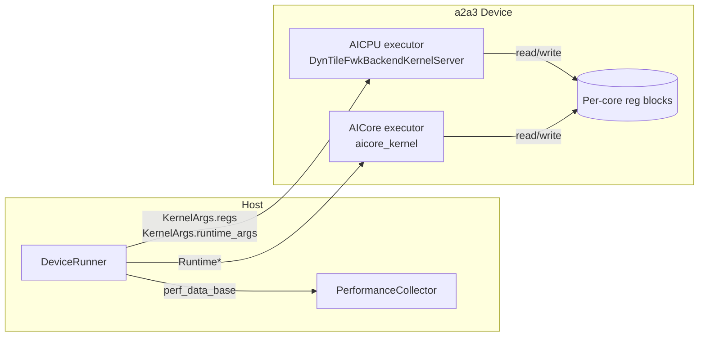

# Annotated Walkthrough: `DeviceRunner` (a2a3 / a2a3sim) + Register Plumbing

Last verified against repo state on **2026-02-26**.

This document is a deep, code-grounded explanation of the most important host-side platform code:

- **a2a3 (real hardware)**:
  - `src/platform/a2a3/host/device_runner.cpp`
  - `src/platform/a2a3/host/device_runner.h`
  - `src/platform/a2a3/host/host_regs.cpp`
  - `src/platform/a2a3/aicpu/kernel.cpp`
- **a2a3sim (simulation)**:
  - `src/platform/a2a3sim/host/device_runner.cpp`
  - `src/platform/a2a3sim/aicore/kernel.cpp`

It explains:
1. how the host launches AICPU/AICore “executor kernels”
2. how per-core register base addresses are computed and passed to AICPU
3. how a2a3sim reproduces the same register protocol via host threads

Companion docs:
- Platform overview: `docs/platform-codewalk.md`
- Runtime scheduler loop: `docs/linebyline-aicpu-resolve-and-dispatch-pto2.md`

> Note on line numbers: `Lxxx` references below match 2026-02-26. Refresh with `nl -ba` if code moves.

---

## 0. The “platform” contract in one diagram

The runtime scheduler assumes a **register-based dispatch protocol**:

- AICPU writes `(COND=BUSY, DATA_MAIN_BASE=task_id+1)` to dispatch
- AICPU polls `COND` and observes it returning to `IDLE` to detect completion

The platform’s job is to make this protocol work on:
- real hardware (MMIO + HAL-derived base addresses)
- simulation (host memory blocks that emulate registers)



---

## 1. a2a3 real device: `DeviceRunner::run` is the canonical launch sequence

File: `src/platform/a2a3/host/device_runner.cpp`

### 1.1 Input validation and “even distribution” constraint (L276–L304)

`run(...)` starts by validating:
- `launch_aicpu_num` in `[1, PLATFORM_MAX_AICPU_THREADS]` (L283–L288)
- `block_dim` in `[1, PLATFORM_MAX_BLOCKDIM]` (L290–L295)

Then the key constraint:

> `block_dim % scheduler_thread_num == 0` (L297–L304)

where `scheduler_thread_num = (launch_aicpu_num == 4) ? 3 : launch_aicpu_num`.

Meaning:
- If you launch 4 AICPU instances, thread 3 is reserved for **device orchestration** and owns **0** cores; only 3 scheduler threads actually manage cores.
- Each scheduler thread must manage an equal number of block groups, so `block_dim` must divide evenly.

This constraint is *platform-layer* enforced because it controls how many AICPU kernel instances are launched and how the runtime partitions cores.

### 1.2 Lazy init: streams + binaries (L306–L311)

`ensure_device_initialized(device_id, aicpu_so_binary, aicore_kernel_binary)` (L306–L311) ensures:
- device is set + streams exist
- AICPU `.so` is uploaded and referenced by the “deviceArgs” ABI
- AICore kernel binary is cached (for `rtRegisterAllKernel`)

This is “lazy” so that calling `set_device()` or `init_runtime()` can happen before you have binaries.

### 1.3 Worker count and handshake initialization (L313–L348)

The platform fixes topology to:

`num_aicore = block_dim * PLATFORM_CORES_PER_BLOCKDIM` (L316–L317)

and writes into the runtime:
- `runtime.worker_count = num_aicore` (L324)
- `runtime.sche_cpu_num = launch_aicpu_num` (L326)

Then it initializes `runtime.workers[i]` handshake fields (L338–L348):
- clears ready/done/control/task/task_status
- sets `core_type`:
  - first `block_dim` workers are AIC (cube)
  - the remaining 2×`block_dim` are AIV (vector)

Why “first 1/3 are AIC” matters:
- scheduler dispatch chooses which ready queue to pop from based on `Handshake.core_type`.
- the runtime assumes this mapping is stable.

### 1.4 Register base addresses: `KernelArgs.regs` (L328–L333)

This is one of the most important platform responsibilities:

```cpp
329 rc = init_aicore_register_addresses(&kernel_args_.args.regs, device_id, mem_alloc_);
```

The returned `kernel_args_.args.regs` is a **device pointer** to an array of `uint64_t` values, one per (sub)core, each value being that core’s register base address.

That pointer is later passed into AICPU as part of `KernelArgs`, and the AICPU platform stub stores it globally via `set_platform_regs(...)`.

### 1.5 `function_bin_addr` assignment (L350–L362)

`init_runtime_impl(...)` already uploaded kernel text blobs and recorded addresses inside `Runtime` (e.g. `func_id_to_addr_[]`).

`DeviceRunner::run` writes these addresses into each `Task`:
- `task->function_bin_addr = runtime.get_function_bin_addr(task->func_id)` (L356–L360)

The scheduler later uses these addresses to build dispatch payloads.

### 1.6 Profiling init (optional) (L364–L371)

If `runtime.enable_profiling`:
- allocate and map perf shared memory
- write `runtime.perf_data_base` (device pointer) so AICPU can find it

Details are in `docs/annotated-platform-profiling.md` (added by this doc set).

### 1.7 Copy runtime to device and launch kernels (L373–L407)

1. `kernel_args_.init_runtime_args(runtime, mem_alloc_)` (L373–L379)
   - allocates device memory for `Runtime`
   - `rtMemcpy` the `Runtime` struct host→device
2. launch the AICPU init entry once (L381–L388)
3. launch the AICPU main entry with `launch_aicpu_num` instances (L390–L397)
4. launch the AICore kernel with `block_dim_` blocks (L399–L406)

Key detail: AICore receives `Runtime*` directly (not KernelArgs).

### 1.8 Poll perf before synchronizing streams (L408–L412)

The perf collector must poll while kernels are running, otherwise:
- buffers may fill and AICPU may spin on buffer switches
- you risk deadlocking if host never marks buffers IDLE

So `poll_and_collect_performance_data(...)` is intentionally called before `rtStreamSynchronize`.

### 1.9 Synchronize + export after completion (L413–L437)

After streams complete:
- export JSON traces (`export_swimlane_json`) (L430–L433)
- runtime args are intentionally freed later in `finalize()` so `print_handshake_results()` can still read device memory.

---

## 2. Real hardware: register discovery via HAL (`host_regs.cpp`)

File: `src/platform/a2a3/host/host_regs.cpp`

The pipeline is:

1. Determine which physical cores are valid (optional) using:
   - `halGetDeviceInfoByBuff(MODULE_TYPE_AICORE, INFO_TYPE_OCCUPY, ...)` (L22–L36)
   - fallback to “assume all valid” if unavailable (L26–L29, L52–L56)
2. Use `halMemCtl` to get a base pointer for the register mapping (L65–L88)
3. Compute each core’s register base:
   - `core_stride = 8MB` (L58)
   - `sub_core_stride = 0x100000` (L59)
   - for each physical core `i` and subcore `j`:
     - `vaddr = base + i*core_stride + j*sub_core_stride` (L92–L104)
     - `j==0` is AIC; `j>0` are AIV
4. Concatenate addresses as:
   - AIC list, then AIV list (L126–L128)

Finally `init_aicore_register_addresses(...)` (L134–L177):
- allocates device memory for the address array (L155–L161)
- copies it host→device via `rtMemcpy` (L163–L168)
- writes the *device pointer* into `KernelArgs.regs` (L170–L175)

This is why the AICPU executor can do:
- `uint64_t reg_addr = core_id_to_reg_addr_[core_id];`
- `read_reg(reg_addr, RegId::COND);`

---

## 3. Real hardware: how AICPU receives regs (`aicpu/kernel.cpp`)

File: `src/platform/a2a3/aicpu/kernel.cpp`

The AICPU entry point `DynTileFwkBackendKernelServer(void* arg)` is called by CANN.

Critical bridge line:
- `set_platform_regs(k_args->regs);` (L71–L73)

This stores the device pointer to the regs array into a platform-global variable:
- declared in `src/platform/include/aicpu/platform_regs.h`
- implemented in `src/platform/src/aicpu/platform_regs.cpp`

Then it calls `aicpu_execute(runtime)` (L74–L82), and the runtime scheduler reads the regs pointer via `get_platform_regs()`.

This split is intentional:
- platform stub is “ABI glue” for the CANN kernel server
- runtime owns scheduling policy

---

## 4. a2a3sim: how simulation reproduces the same semantics

File: `src/platform/a2a3sim/host/device_runner.cpp`

### 4.1 Loading executors with dlopen (L44–L109)

Simulation writes the passed binaries to `/tmp/*.so` and dlopens them:
- `aicpu_execute` symbol from the AICPU SO (L68–L72)
- `set_platform_regs` symbol too (L74–L78)
- `aicore_execute_wrapper` symbol from the AICore SO (L100–L105)

This is why the simulation can run the real scheduler code: it literally dlopens the same built artifacts.

### 4.2 Simulated register blocks (L223–L255)

Simulation allocates:
- one `SIM_REG_BLOCK_SIZE` byte block per core (L223–L231)
- an array of `uint64_t` base addresses pointing into those blocks (L232–L243)

It stores that array pointer into `kernel_args_.regs` (L243–L245), then calls:
- `set_platform_regs_func_(kernel_args_.regs)` (L253–L255)

So the runtime AICPU executor reads the same regs array pointer as on real hardware.

### 4.3 Thread-based launch (L256–L306)

Simulation spawns:
- `launch_aicpu_num` host threads calling `aicpu_execute_func_(&runtime)` (L256–L264)
- `num_aicore` host threads calling `aicore_execute_wrapper(...)` (L265–L274)
- an optional host collector thread calling `poll_and_collect_performance_data(...)` (L276–L283)

### 4.4 AICore wrapper sets thread-local reg base (a2a3sim)

File: `src/platform/a2a3sim/aicore/kernel.cpp`

`aicore_execute_wrapper(...)` sets:
- `g_sim_reg_base` to `regs_array[physical_core_id]`
- `g_sim_physical_core_id = physical_core_id`

Then calls the runtime’s `aicore_execute(...)`.

Inside `src/platform/a2a3sim/aicore/inner_kernel.h`, `read_reg/write_reg` read/write from `g_sim_reg_base + reg_offset(...)`.

Net effect:
- runtime sees the same “regs” protocol even in simulation.

---

## 5. Practical debugging checklist (platform layer)

1. **If dispatch never happens (all cores idle)**
   - verify `KernelArgs.regs` is non-zero and `set_platform_regs(...)` is called (a2a3: `aicpu/kernel.cpp:71`)
   - verify `init_aicore_register_addresses` succeeded and copied correct addresses (a2a3: `host_regs.cpp`)
2. **If completion never detected**
   - verify AICore executor writes `COND` transitions correctly (runtime-level), and AICPU reads the right reg base
3. **If profiling stalls**
   - ensure host collector runs *during execution* (a2a3: `DeviceRunner::run` does this at L408–L412)
4. **If a2a3sim behaves differently**
   - inspect simulated reg blocks and wrapper (`a2a3sim/aicore/kernel.cpp`)
   - ensure the correct symbols are dlopen’d (`aicore_execute_wrapper`, `aicpu_execute`)

