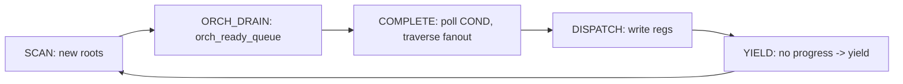

# Line-by-line: `resolve_and_dispatch_pto2` (AICPU Scheduler Loop)

Last verified against repo state on **2026-02-26**.

This document is a line-numbered, code-grounded explanation of:
- `src/runtime/tensormap_and_ringbuffer/aicpu/aicpu_executor.cpp:423` (`AicpuExecutor::resolve_and_dispatch_pto2`)

It focuses on the **a2a3 real-hardware scheduling model**, but the logic is the same under `a2a3sim`.

Companion docs:
- `docs/annotated-aicpu-executor-scheduler.md` (broader file walkthrough)
- `docs/tensormap-ringbuffer-runtime-guide.md` (profiling outputs + report)
- `docs/linebyline-pto2-submit-task.md` (the submit-side that feeds this scheduler)

> Note on line numbers: all `Lxxx` references below match the repo state on 2026-02-26. If code changes, re-run `nl -ba` to refresh.

---

## 0. What this function is responsible for

Each AICPU scheduler thread that owns a set of AICore workers runs this loop to:

1. **Discover ready tasks** (two sources):
   - SCAN: root tasks whose `fanin_count == 0`
   - ORCH_DRAIN: “already-ready” tasks pushed by the orchestrator fast-path (see `pto2_submit_task` Step 5b)
2. **Detect task completion** by polling per-core registers (`RegId::COND`)
3. **Propagate readiness** by traversing the completing task’s fanout list and incrementing dependents’ `fanin_refcount`
4. **Dispatch** ready tasks to idle AICore workers by writing task id to `RegId::DATA_MAIN_BASE`
5. Optionally **patch perf records** with AICPU-side dispatch/finish timestamps, and **export scheduler phase timings**

The loop is structured into these phases per iteration:



---

## 1. Key shared state (mental model)

### 1.1 “Task status” state machine: `s_pto2_task_completed[slot]`

This array is *not just “completed”*. It’s used as a tiny state machine to prevent double-enqueue:

| Value | Meaning in this scheduler | Who writes |
|---:|---|---|
| `0` | not enqueued/unknown | init only |
| `1` | enqueued / ready (or already discovered as root) | SCAN / ORCH_DRAIN / fanout propagation |
| `2` | completed | COMPLETE phase |

Important nuance:
- It’s indexed by `slot = task_id & window_mask`, so it assumes the task window is not reused during the run (current workloads keep `task_count_final <= task_window_size`).

### 1.2 Fanin completion counter: `s_pto2_fanin_refcount[slot]`

This tracks “how many producer completions have been observed for the consumer task”.

When a producer completes, the scheduler traverses its fanout edges:
- `prev = fetch_add(fanin_refcount[consumer], 1)`
- if `prev + 1 == consumer_desc->fanin_count` then the consumer becomes ready and is enqueued

This is how “DAG edges” become “ready queue items”.

### 1.3 Ready queues

There are two ready queues, protected by simple mutexes:
- `ready_queue_aic_...` for cube (AIC) tasks
- `ready_queue_aiv_...` for vector (AIV) tasks

Root tasks are enqueued based on `task->worker_type`, and dispatch chooses the matching queue based on `h->core_type`.

---

## 2. Code walk (by phase, with line numbers)

### 2.1 Entry: map shared memory + initialize globals (L423–L506)

File: `src/runtime/tensormap_and_ringbuffer/aicpu/aicpu_executor.cpp`

Key points:
- `sm_base = runtime->get_pto2_gm_sm_ptr()` (L427): base address of the PTO2 shared memory buffer (GM).
- It waits for thread 3 to initialize the SM header in **device orchestration** mode (L434–L439).
- It computes pointers into the SM buffer using header offsets:
  - `task_descriptors = sm_base + header->task_descriptors_offset` (L446–L447)
  - `dep_list_pool = sm_base + header->dep_list_pool_offset` (L448–L449)
- One-time init barrier clears shared arrays and (if profiling enabled) assigns perf buffers (L461–L479).

Why perf init happens here:
- If perf buffers are assigned late, early tasks might execute without a valid `perf_records_addr`.

### 2.2 Loop termination checks (L511–L528)

The loop ends only when:
- orchestration is done and there are no tasks (`orch_done && task_count == 0`), or
- all tasks are completed *and* all cores are idle *and* orchestration is done.

This “all cores idle” check matters because:
- task completion is detected by polling registers; `completed_tasks_` might reach `task_count`, but a core could still have a task in flight that has not yet flipped COND to IDLE.

### 2.3 SCAN: discover root tasks (L532–L573)

This phase incrementally scans `0..visible-1` where:
- `visible = header->current_task_index` (acquire load) (L534)

`next_scan_index_` is a global atomic cursor shared across scheduler threads:
- each thread CAS-es it from `idx` to `idx+1` to claim work (L547–L550)

Root discovery:
- If `t->fanin_count == 0`, it marks `task_completed[slot] = 1` (enqueued) and pushes the task id into the appropriate ready queue based on `t->worker_type` (L555–L569).

Profiling hook:
- if `enable_profiling` and visible changed, it updates `PerfDataHeader.total_tasks` (L536–L544) so the host collector can stop without knowing final task count upfront.

### 2.4 ORCH_DRAIN: drain orchestrator’s ready queue (L576–L611)

This handles the “orchestrator already knows the task is ready” fast-path:
- orchestrator pushes task ids into `orch_ready_queue` after it finalizes `fanin_count` and observes `fanin_refcount >= fanin_count` (submit-side Step 5b)

The scheduler drains it with:
- `head/tail` acquire loads (L580–L582)
- CAS head to claim one element (L585–L586)
- CAS `s_pto2_task_completed[slot]` from `0`→`1` to ensure it doesn’t enqueue the same task twice (L591–L595)

Then it pushes the task into the matching ready queue (L596–L607).

### 2.5 COMPLETE: detect completion, patch perf, propagate fanout (L612–L737)

Completion detection per core:
- read `COND` register (L616)
- if `COND==IDLE` and `executing_task_ids_[core_id] >= 0`, the core just finished that task (L617)

#### 2.5.1 Patching perf records with AICPU timestamps (L622–L689)

What it’s trying to achieve:
- AICore writes `PerfRecord.start/end/kernel_ready_time`.
- AICPU wants to also write:
  - `PerfRecord.dispatch_time`: when AICPU dispatched the task
  - `PerfRecord.finish_time`: when AICPU observed completion

The difficulty:
- Perf records are written by AICore into a ping-pong buffer; visibility and buffer switches can reorder “where the record is”.

So the code:
- captures `finish_ts = get_sys_cnt_aicpu()` (L625)
- searches for the record by `task_id` near the tail of a buffer (L630–L646)
- tries current buffer first (L657–L659), then both buffers via `get_core_double_buffer` (L662–L668)
- retries for a small number of iterations to tolerate “COND flipped to IDLE slightly before perf record became visible” (L670–L682)
- increments `perf_ts_update_ok/fail` counters

This is the primary place where “profiling overhead / jitter” can come from when tasks are extremely small.

#### 2.5.2 Mark completed + snapshot fanout under lock (L695–L700)

```cpp
695 // Acquire fanout_lock, mark completed (state=2), snapshot fanout_head
696 while (PTO2_EXCHANGE(&pto2_task->fanout_lock, 1) != 0) { ... }
697 __atomic_store_n(&s_pto2_task_completed[task_id & window_mask], 2, __ATOMIC_RELEASE);
698 int32_t fanout_head = pto2_task->fanout_head;
699 PTO2_STORE_RELEASE(&pto2_task->fanout_lock, 0);
```

Why it needs the lock:
- Orchestrator is still potentially appending to the producer’s fanout list (`pto2_add_consumer_to_producer`).
- Scheduler needs a consistent snapshot of `fanout_head` to traverse without racing on list pointers.

#### 2.5.3 Traverse fanout and enqueue newly-ready consumers (L701–L729)

For each consumer in the fanout list:
- `prev = fetch_add(fanin_refcount[consumer], 1)` (L709)
- read `consumer_desc->fanin_count` (acquire) (L711)
- if `prev+1 == fanin_count`, the consumer becomes ready:
  - mark `task_completed[consumer_slot] = 1` (L713)
  - enqueue it to AIC or AIV ready queue by worker_type (L714–L723)

It collects fanout traversal stats:
- total traversed edges (L727)
- max fanout length (L728)

Finally it:
- decrements tasks-in-flight, increments completed counters
- increments global `completed_tasks_` (L733–L734)

### 2.6 DISPATCH: write registers to start work (L738–L787)

Only attempts dispatch if the thread has spare capacity:
- `cur_thread_tasks_in_flight < core_num` (L739)

For each idle core:
1. pop a task id from the ready queue matching `h->core_type` (L747–L759)
2. build dispatch payload (`build_pto2_payload`) (L760–L763)
3. if profiling enabled:
   - record dispatch timestamp (L766)
   - switch perf buffer if `core_dispatch_counts_` reaches buffer capacity (L767–L771)
4. write registers in a specific order (L773–L777):
   - first set `COND=BUSY`
   - then set `DATA_MAIN_BASE = task_id + 1`

That ordering is deliberate: if `DATA_MAIN_BASE` were written first, AICPU could briefly observe `COND==IDLE` with `executing_task_ids_` set, incorrectly treating it as “completed”.

### 2.7 YIELD: no progress (L788–L806)

If nothing progressed in the iteration:
- increment idle counter and occasionally warn
- yield the OS thread (`std::this_thread::yield()`)
- track yield time in `sched_yield_cycle`
- eventually error out after `MAX_IDLE_ITERATIONS`

This is the phase you want to minimize when the scheduling budget is tiny (e.g. 25µs target).

### 2.8 End-of-run exports: scheduler phase profile + perf flush (L808–L930)

When compiled with `PTO2_ORCH_PROFILING`:
- it prints a per-thread phase breakdown (percentages) (L809–L841)
- it prints one machine-readable JSON line (L845–L885)
- **and importantly:** it writes the phase stats into perf shared memory:
  - `PerfDataHeader.sched_profiles[thread_idx]` (L888–L921)
  - sets bit `thread_idx` in `sched_profiles_ready_mask` so host can export it to JSON

Finally it flushes any partially-filled perf buffers (L924–L927) and returns `cur_thread_completed`.

---

## 3. Why the memory ordering is “just enough”

Key publish/consume pairs:

1. **Task visibility**
   - Orchestrator stores `header->current_task_index` with release.
   - Scheduler loads it with acquire (L534).
   - This ensures: once `visible` includes task `t`, `t->fanin_count` and other descriptor fields are safe to read.

2. **Fanin list validity**
   - Orchestrator stores `t->fanin_count` with `__ATOMIC_RELEASE` after building `fanin_head`.
   - Scheduler loads `fanin_count` with acquire (L555, L711).
   - This ensures: if scheduler sees nonzero fanin_count, the fanin list is already built (for the parts of the runtime that traverse it).

3. **Fanout list snapshot**
   - Both append and snapshot use `fanout_lock` plus release stores, making traversal safe without holding the lock.

---

## 4. Optimization checklist (scheduler path)

Ordered by “most likely to reduce µs-level scheduling overhead”:

1. **Reduce SCAN work**
   - Current SCAN checks every new task once and reads `fanin_count` (acquire) (L546–L571).
   - If orch_ready_queue is effective, SCAN could potentially be skipped or throttled (e.g., only scan until some quota per loop).
2. **Reduce contention on ready queue locks**
   - All scheduler threads push into the same AIC/AIV queues guarded by mutexes.
   - Consider per-thread queues + work stealing, or lock-free ring buffers.
3. **Reduce fanout traversal overhead**
   - Traversal is on completion hot path; large fanout can dominate completion time.
   - Consider compressing dep list entries, prefetching, or limiting fanout len by TensorMap truncation policies upstream.
4. **Reduce perf timestamp patching overhead / jitter**
   - `find_record_near_tail` + retries add variable overhead; for microtasks this can distort scheduling time.
   - If total latency fluctuates too much, reduce retry iters/window size or patch only 1/N tasks during tuning.
5. **Replace `std::this_thread::yield()`**
   - Yield is highly OS-dependent; under tight budgets, a short pause loop may be more stable than yielding.
6. **Implement true slot reuse (if needed)**
   - Many arrays are indexed by `task_id & window_mask`.
   - If you ever exceed `task_window_size`, you must make slot reuse correct end-to-end (including TensorMap validity and s_pto2_* arrays).

