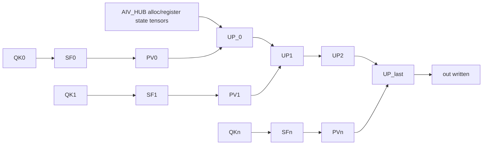

# Paged Attention (tensormap_and_ringbuffer): Code Walk

Last verified against repo state on **2026-02-26**.

This document explains what the paged-attention example does, at the level of:
- exact tensors and shapes used
- each submitted task and its parameters
- the dependency DAG created by TensorMap overlap
- what each kernel implementation computes

Primary sources:
- Orchestration: `tests/device_tests/tensormap_and_ringbuffer/paged_attention/kernels/orchestration/paged_attention_orch.cpp`
- Kernel config: `tests/device_tests/tensormap_and_ringbuffer/paged_attention/kernels/kernel_config.py`
- Golden: `tests/device_tests/tensormap_and_ringbuffer/paged_attention/golden.py`
- Kernels:
  - `tests/device_tests/tensormap_and_ringbuffer/paged_attention/kernels/aic/aic_qk_matmul.cpp`
  - `tests/device_tests/tensormap_and_ringbuffer/paged_attention/kernels/aiv/aiv_softmax_prepare.cpp`
  - `tests/device_tests/tensormap_and_ringbuffer/paged_attention/kernels/aic/aic_pv_matmul.cpp`
  - `tests/device_tests/tensormap_and_ringbuffer/paged_attention/kernels/aiv/aiv_online_update.cpp`

---

## 1. What “Paged Attention” Means Here

The “paged” part is the **block table**:
- Keys/values are stored in a block pool.
- Each request (batch element) has a `block_table[b, bn]` that tells you which physical block index to use for its bn-th logical KV block.

This example then runs an **online-softmax** attention update across blocks:
- It processes blocks in order `bn = 0..bn_last` and maintains running accumulators:
  - `mi` (running max per query row)
  - `li` (running sum-of-exp per query row)
  - `oi` (running numerator per query row and head_dim)
- On the last block, it writes `out = oi / li`.

---

## 2. Source-of-Truth Shapes and Task Count

Golden input generation is the authoritative place to read shapes:
- `tests/device_tests/tensormap_and_ringbuffer/paged_attention/golden.py`

It defines two cases:

### Case1 (default)
- `batch=64`
- `num_heads=16`
- `kv_head_num=1` (GQA style, but only the `==1` case is supported here)
- `head_dim=128`
- `block_size=128`
- `context_len=8193`
- `max_model_len=32768`

Derived:
- `max_num_blocks_per_req = max_model_len / block_size = 256`
- `bn_this_batch = ceil(context_len / block_size) = ceil(8193/128) = 65`
- head tiling:
  - `q_tile = min(num_heads, 128) = 16`
  - `q_loop = ceil(num_heads / q_tile) = 1`

Task count (this matches the profiler output `16704`):
- per `(b_idx, q_idx)`:
  - `1` hub task (`AIV_HUB`)
  - per block: `QK + SF + PV + UP` = `4`
  - total: `1 + 65*4 = 261`
- total tasks: `batch * q_loop * 261 = 64 * 1 * 261 = 16704`

### Case2
- `batch=64`, `num_heads=64`, `head_dim=128`
- `block_size=64`, `context_len=8192`
- `bn_this_batch = 8192/64 = 128`
- `q_tile = 64`, `q_loop = 1`
- total tasks: `64 * (1 + 128*4) = 32832`

---

## 3. Kernel IDs and Worker Types

The runtime treats `kernel_id` as an opaque integer; the mapping is defined by:
- `tests/device_tests/tensormap_and_ringbuffer/paged_attention/kernels/kernel_config.py`

| kernel_id | name | core |
|---:|---|---|
| 0 | `QK` | AIC (CUBE) |
| 1 | `SF` | AIV (VECTOR) |
| 2 | `PV` | AIC (CUBE) |
| 3 | `UP` | AIV (VECTOR) |
| 4 | `AIC_HUB` | AIC (CUBE, no-op) |
| 5 | `AIV_HUB` | AIV (VECTOR, no-op) |

Important: `AIV_HUB`/`AIC_HUB` are empty kernels in this example. They mainly exist to force allocation/registration of “state” buffers (so dependency edges can form).

---

## 4. Orchestration Function Walkthrough (Task by Task)

File:
- `tests/device_tests/tensormap_and_ringbuffer/paged_attention/kernels/orchestration/paged_attention_orch.cpp`

The orchestration `.so` exports two functions:

### 4.1 `aicpu_orchestration_config(args, arg_count)`

Returns:
- `.expected_arg_count = 15`

This is used by the executor to validate that it received enough arguments.

### 4.2 `aicpu_orchestration_entry(rt, args, arg_count)`

This function builds the DAG by calling `pto2_rt_submit_task(rt, ...)` many times.

#### 4.2.1 Argument unpacking

The args are:

Pointers (first 7):
0. `host_query` (device ptr): `[batch, num_heads, head_dim]` flattened
1. `host_key_cache`: KV block pool flattened
2. `host_value_cache`: KV block pool flattened
3. `host_block_table`: `[batch, block_num]` int32
4. `host_context_lens`: `[batch]` int32
5. `host_out`: output buffer
6. `host_config`: int64 config array

Sizes (next 7):
7..13: byte sizes for those buffers

Then config fields:
- `host_config[0..6]` contains `batch`, `num_heads`, `kv_head_num`, `head_dim`, `block_size`, `block_num`, `scale_bits`.

#### 4.2.2 Constructing the top-level `Tensor`s

The orchestration creates external tensors:
- `query`: shape `[batch * num_heads, head_dim]` bf16
- `key_cache`: shape `[batch * block_num * block_size, head_dim]` bf16
- `value_cache`: same shape as key_cache bf16
- `out`: shape `[batch * num_heads, head_dim]` fp32

Note: `block_table` and `context_lens` are not wrapped as `Tensor`s; they’re read as raw CPU pointers by the orchestration code and used only for computing indices/valid_len.

#### 4.2.3 The loop nest

Core loops:

```
for b_idx in [0..batch):
  cur_seq = context_lens[b_idx]
  bn_this_batch = ceil(cur_seq / block_size)
  for q_idx in [0..q_loop):
    PTO2_SCOPE(rt) { ... per (b_idx, q_idx) ... }
```

That `PTO2_SCOPE` is important: it groups all tasks for a single `(b_idx, q_idx)` slice.

#### 4.2.4 Inside the scope: state tensors and `AIV_HUB`

It allocates three runtime-allocated tensors (buffer.addr initially 0):
- `oi`: shape `[q_tile, head_dim]` fp32
- `li_update`: shape `[q_tile]` fp32
- `mi_update`: shape `[q_tile]` fp32

Then it submits:
- `AIV_HUB` with **three OUTPUT** params:
  - `OUTPUT(oi)`, `OUTPUT(li_update)`, `OUTPUT(mi_update)`

In this example, the kernel is empty (no compute), so *values are not initialized*.
The hub’s role is: allocate/register these buffers so subsequent `INOUT` uses create a stable dependency chain in TensorMap.

#### 4.2.5 Per block `bn`: QK → SF → PV → UP

For each block `bn`:

1. Build views:
   - `qi = query.view([q_tile, head_dim], offsets=[cur_offset, 0])`
   - `cur_block_idx = block_table[b_idx * block_num + bn]`
   - `valid_len = min(block_size, cur_seq - bn*block_size)`
   - `kj = key_cache.view([block_size, head_dim], offsets=[cur_block_idx*block_size, 0])`
   - `vj = value_cache.view([block_size, head_dim], offsets=[cur_block_idx*block_size, 0])`

2. Allocate intermediate buffers:
   - `sij`: `[q_tile, block_size]` fp32 (OUTPUT, runtime allocated)
   - `pij_f16`: `[q_tile, block_size]` bf16 (OUTPUT, runtime allocated)

3. Submit `QK` (kernel_id=0, worker=CUBE)
   - params:
     - `INPUT(qi)`
     - `INPUT(kj)`
     - `OUTPUT(sij)`

4. Submit `SF` (kernel_id=1, worker=VECTOR)
   - it slices `sij_valid = sij.view([q_tile, valid_len], [0, 0])`
   - allocates:
     - `mi`: `[q_tile]` fp32 (OUTPUT)
     - `li`: `[q_tile]` fp32 (OUTPUT)
   - params:
     - `INPUT(sij_valid)`
     - `SCALAR(scale)`
     - `OUTPUT(pij_f16)`
     - `OUTPUT(mi)`
     - `OUTPUT(li)`

How `valid_len` is communicated:
- the `SF` kernel reads `valid_len` from `sij->repeats[1]` (because `sij_valid` is a view with repeats[1]=valid_len).

5. Submit `PV` (kernel_id=2, worker=CUBE)
   - allocates `oi_tmp`: `[q_tile, head_dim]` fp32 (OUTPUT)
   - params:
     - `INPUT(pij_f16)`
     - `INPUT(vj)`
     - `OUTPUT(oi_tmp)`

6. Submit `UP` (kernel_id=3, worker=VECTOR)
   - `is_first = (bn==0)`, `is_last = (bn==bn_this_batch-1)`
   - `out_view = out.view([q_tile, head_dim], [cur_offset, 0])`
   - params:
     - `INPUT(mi)`
     - `INPUT(li)`
     - `INPUT(oi_tmp)`
     - `INOUT(mi_update)`
     - `INOUT(li_update)`
     - `INOUT(oi)`
     - `OUTPUT(out_view)`  (only meaningful when `is_last`)
     - `SCALAR(is_first)`
     - `SCALAR(is_last)`

Why this creates the “online” chain:
- `mi_update/li_update/oi` are the same buffers every block.
- Each `UP_bn` is an `INOUT` user and then producer of those same regions.
- TensorMap overlap sees that `UP_bn` overlaps the previous producer of these regions → adds dependency `UP_{bn-1} → UP_bn`.

So the core dependency spine is:



---

## 5. Kernel Code Walk (What Each Kernel Computes)

### 5.1 `QK` (`aic_qk_matmul.cpp`)

File: `tests/device_tests/tensormap_and_ringbuffer/paged_attention/kernels/aic/aic_qk_matmul.cpp`

Behavior:
- Reads `q_tile_size` from `qi->repeats[0]`.
- Dispatches one of two templates:
  - `M=16,K=128,N=128`
  - `M=64,K=128,N=64`

Key detail: `K` is **not stored pre-transposed**.
- `kj` is stored as `(block_size, head_dim)` in row-major.
- The kernel sets `GlobalB` to `Layout::DN` and uses a tile type that matches the transposed-B access pattern.

### 5.2 `SF` (`aiv_softmax_prepare.cpp`)

File: `tests/device_tests/tensormap_and_ringbuffer/paged_attention/kernels/aiv/aiv_softmax_prepare.cpp`

It reads:
- `valid_len = sij->repeats[1]`

Then performs:
1. `TLOAD(sijTile, sijGlobal)` loads full `(M,N)` tile
2. `TFILLPAD_INPLACE(...)` fills `[valid_len, N)` columns with `-inf` (PadValue::Min)
3. multiply by `scale`
4. row max (`TROWMAX`) → `mij`
5. row exp-sub (`TROWEXPANDSUB`) + `TEXP` → `pij`
6. convert to bf16 and back to fp32 before sum (matches golden’s truncation)
7. row sum (`TROWSUM`) → `lij`
8. store `mij`, `lij`, `pij(bf16)`

### 5.3 `PV` (`aic_pv_matmul.cpp`)

File: `tests/device_tests/tensormap_and_ringbuffer/paged_attention/kernels/aic/aic_pv_matmul.cpp`

Computes:
- `oi_new = pij @ vj`

Uses template dispatch based on `pij->repeats[0]` (q_tile_size):
- Case1: `(16×128) @ (128×128) → (16×128)`
- Case2: `(64×64) @ (64×128) → (64×128)`

### 5.4 `UP` (`aiv_online_update.cpp`)

File: `tests/device_tests/tensormap_and_ringbuffer/paged_attention/kernels/aiv/aiv_online_update.cpp`

Implements the standard online softmax accumulation:
- if first:
  - `mi = mij`, `li = lij`, `oi = oi_new`
  - if also last: write `dst = oi / li`
- else:
  - `mi_new = max(mi, mij)`
  - `alpha = exp(mi - mi_new)`
  - `beta  = exp(mij - mi_new)`
  - `li = alpha*li + beta*lij`
  - `oi = alpha*oi + beta*oi_new`
  - if last: `dst = oi / li` else store updated `oi`

Implementation detail worth noticing:
- Scalar vectors (`mi/li/mij/lij`) are stored in GM as contiguous floats.
- The kernel uses an ND layout for element-wise ops and reloads them as DN layout for row-broadcast ops (`TROWEXPANDMUL/DIV`).
- It performs ND→DN conversion via a “GM round-trip” (store then load with a DN GlobalTensor view).

---

## 6. Why This Example is a “Scheduling Stress Test”

Per block you get 4 tiny kernels. In Case1 you have:
- `64 * 65 * 4 = 16640` compute tasks
- plus `64` hub tasks

If each kernel runs ~1–2 µs but the schedule window is ~25–32 µs, then:
- end-to-end latency is dominated by AICPU scheduling mechanics (dispatch + completion detection), not math.

This is why the schedule profiling/report tooling in `tools/pto2_schedule_report.py` is important for this example.

