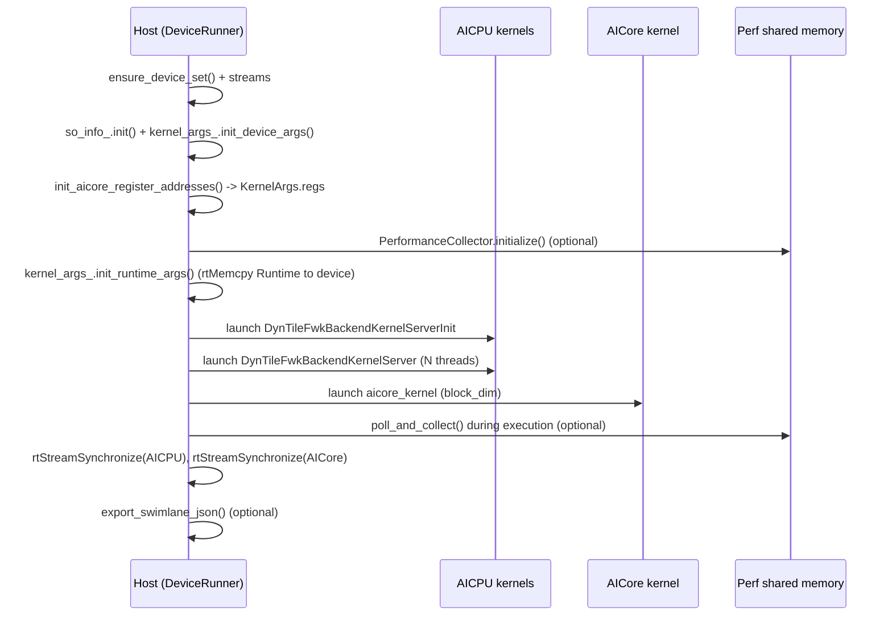

# Platform Layer Code Walk (`src/platform/*`): a2a3 vs a2a3sim

Last verified against repo state on **2026-02-26**.

This document explains the “platform” directory: the glue that makes the runtime run on:
- **a2a3**: real Ascend device via CANN runtime + HAL
- **a2a3sim**: host-thread simulation with the same public API

Scope:
- **Host side**: kernel launch, device memory, perf collection
- **Device side**: AICPU/AICore wrapper entry points, register access, device logging, profiling buffers

Companion docs (runtime-specific, built on top of this):
- `docs/tensormap-ringbuffer-runtime-guide.md`
- `docs/annotated-aicpu-executor-scheduler.md`
- `docs/linebyline-aicpu-resolve-and-dispatch-pto2.md`

Deeper platform deep-dives:
- `docs/annotated-platform-device-runner.md` (DeviceRunner, regs plumbing, a2a3 vs a2a3sim)
- `docs/annotated-platform-profiling.md` (Perf buffers, queues, scheduler profiles export)

---

## 0. Directory map (what lives where)

```
src/platform/
  include/                    # cross-platform headers (host+device)
    common/                   # platform_config, perf structs, kernel args, logging
    host/                     # host interfaces (allocator, perf collector, regs)
    aicpu/                    # aicpu interfaces (regs, log, device malloc, time)
    aicore/                   # aicore interfaces (perf record helper)

  src/                        # platform-agnostic implementations (host + device)
    host/performance_collector.cpp
    aicpu/performance_collector_aicpu.cpp
    aicpu/platform_regs.cpp
    host/unified_log_host.cpp
    aicpu/unified_log_device.cpp

  a2a3/                       # real hardware platform binding (CANN + HAL)
    host/device_runner.*      # the “runner” used by Python / examples
    host/host_regs.cpp        # HAL-based register base discovery
    host/memory_allocator.cpp # rtMalloc/rtFree wrapper
    aicpu/kernel.cpp          # AICPU entry points called by libaicpu_extend_kernels.so
    aicpu/aicpu_regs.cpp      # MMIO read/write of AICore regs (COND/DATA_MAIN_BASE)
    aicpu/device_*            # device log, device malloc (halMemAlloc), time
    aicore/kernel.cpp         # AICore entry point calling runtime’s aicore_execute
    aicore/inner_kernel.h     # AICore-side register/time intrinsics for real HW

  a2a3sim/                    # simulation binding (threads + dlopen)
    host/device_runner.*      # same API as a2a3 runner; uses threads
    host/memory_allocator.cpp # malloc/free wrapper
    aicpu/*                   # simulation device_log/time/malloc
    aicore/kernel.cpp         # sets thread_local simulated regs, calls aicore_execute
    aicore/inner_kernel.h     # simulated time + register access
```

If you only want one mental model:
- `DeviceRunner` is the platform’s “main” entry from the host’s perspective.
- `kernel.cpp` (AICPU/AICore) are the platform’s “main” entry from the device’s perspective.

---

## 1. The platform contract: shared constants and register protocol

### 1.1 `platform_config.h`: the single source of truth for limits + register offsets

File: `src/platform/include/common/platform_config.h`

This header defines constants used across host/AICPU/AICore:

- **Topology**
  - `PLATFORM_MAX_BLOCKDIM = 24`
  - `PLATFORM_CORES_PER_BLOCKDIM = 3` (1 AIC + 2 AIV)
  - `PLATFORM_MAX_AICPU_THREADS = 4`

- **Profiling**
  - `PLATFORM_PROF_SYS_CNT_FREQ = 50MHz` (used by `cycles_to_us`)
  - `PLATFORM_PROF_BUFFER_SIZE = 1000` records per ping/pong buffer
  - `PLATFORM_PROF_READYQUEUE_SIZE = PLATFORM_MAX_CORES*2`

- **Register protocol**
  - `RegId::DATA_MAIN_BASE`: “task dispatch” register (AICPU → AICore)
  - `RegId::COND`: “status” register (AICore → AICPU), `IDLE=0`, `BUSY=1`
  - Offsets (real hardware SPR offsets): `REG_SPR_DATA_MAIN_BASE_OFFSET`, `REG_SPR_COND_OFFSET`, ...

This file is important because the *runtime scheduler* (in `src/runtime/.../aicpu_executor.cpp`) assumes:
- writing `DATA_MAIN_BASE` is how a task is dispatched
- reading `COND` is how completion is observed

---

## 2. Kernel argument ABI: how host passes pointers into AICPU

### 2.1 `KernelArgs`: the struct passed to AICPU kernels

File: `src/platform/include/common/kernel_args.h`

```cpp
struct KernelArgs {
  uint64_t unused[5];
  DeviceArgs* device_args;
  Runtime* runtime_args;
  uint64_t regs;  // per-core register base array
};
```

Key concept: **layout matters**.
On real a2a3, `libaicpu_extend_kernels.so` expects certain offsets for fields (hence the padding).

### 2.2 `DeviceArgs`: the struct CANN’s AICPU loader expects

File: `src/platform/a2a3/host/device_runner.h`

```cpp
struct DeviceArgs {
  uint64_t unused[12];
  uint64_t aicpu_so_bin;
  uint64_t aicpu_so_len;
};
```

This is the binary blob the AICPU runtime uses to locate the AICPU `.so` code on device.

---

## 3. Register access: how AICPU writes dispatch and polls completion

### 3.1 Host discovers register base addresses (a2a3)

Files:
- `src/platform/a2a3/host/host_regs.cpp`
- `src/platform/include/host/host_regs.h`

What happens:
1. Query HAL for a base pointer via `halMemCtl(ADDR_MAP_TYPE_REG_AIC_CTRL, ...)`.
2. For each physical core `i`, compute subcore base addresses using:
   - `core_stride = 8MB`
   - `sub_core_stride = 0x100000`
3. Build a vector: **all AIC cores first, then all AIV cores**.
4. Allocate a device array for these addresses and copy it to device memory.
5. Store that device pointer into `KernelArgs.regs`.

Why this exists:
- The AICPU scheduler does MMIO reads/writes against these per-core register blocks.

### 3.2 AICPU receives `KernelArgs.regs` and stashes it globally

Files:
- `src/platform/a2a3/aicpu/kernel.cpp`
- `src/platform/include/aicpu/platform_regs.h`
- `src/platform/src/aicpu/platform_regs.cpp`

In the AICPU kernel entry:
- `set_platform_regs(k_args->regs);`

The runtime scheduler later does:
- `regs_ = get_platform_regs();`
- uses it to build `core_id_to_reg_addr_[]` and call `read_reg(reg_base, RegId::COND)` / `write_reg(...)`.

### 3.3 AICPU read/write of AICore registers

Files:
- `src/platform/include/aicpu/aicpu_regs.h`
- `src/platform/a2a3/aicpu/aicpu_regs.cpp` (real)
- `src/platform/a2a3sim/aicpu/aicpu_regs.cpp` (sim)

Both platforms implement:
- `read_reg(uint64_t reg_base_addr, RegId reg)`
- `write_reg(uint64_t reg_base_addr, RegId reg, uint64_t value)`

They are intentionally tiny:
- compute `ptr = reg_base_addr + reg_offset(reg)`
- do volatile access + barrier (`__sync_synchronize`)

The scheduler depends on this path being fast.

### 3.4 AICore-side register ops (for kernels / profiling)

Files:
- `src/platform/a2a3/aicore/inner_kernel.h` (real)
- `src/platform/a2a3sim/aicore/inner_kernel.h` (sim)

On real hardware, the “AICore kernel code” interacts with registers differently (SPR instructions).
On sim, it uses thread-local pointers to a host-allocated register block.

---

## 4. DeviceRunner: host-side execution pipeline

### 4.1 a2a3 real device runner

Files:
- `src/platform/a2a3/host/device_runner.h`
- `src/platform/a2a3/host/device_runner.cpp`

The `DeviceRunner::run(...)` sequence is:



Where to read it in code:
- `DeviceRunner::run` in `device_runner.cpp`:
  - validates `block_dim` and `launch_aicpu_num`
  - sets up `runtime.worker_count`, `runtime.sche_cpu_num`
  - fills the `runtime.workers[]` handshake array (core_type, initial flags, perf addr)
  - initializes profiling (optional)
  - launches kernels and collects perf

### 4.2 a2a3sim runner (threads + dlopen)

Files:
- `src/platform/a2a3sim/host/device_runner.*`
- `src/platform/a2a3sim/aicore/kernel.cpp`

Differences:
- no `rtKernelLaunch*`; instead spawns:
  - `launch_aicpu_num` host threads calling `aicpu_execute_func_`
  - `num_aicore` host threads calling `aicore_execute_wrapper(...)`
- it allocates a simulated regs array:
  - one `SIM_REG_BLOCK_SIZE` block per core
  - stores an array of base pointers into `kernel_args_.regs`
- the AICore wrapper sets `thread_local g_sim_reg_base` based on `physical_core_id`, so `read_reg/write_reg` inside kernels work.

This is why a2a3sim can share *the same* runtime scheduler code: it preserves the same register protocol.

### 4.3 C API boundary (what Python ctypes calls)

Files:
- `src/platform/include/host/pto_runtime_c_api.h` (public C ABI)
- `src/platform/a2a3/host/pto_runtime_c_api.cpp` (real hardware implementation)
- `src/platform/a2a3sim/host/pto_runtime_c_api.cpp` (simulation implementation)

This layer wraps C++ objects as opaque pointers and exposes a stable C ABI:

- `get_runtime_size()`:
  - tells Python how many bytes to `malloc` for a `Runtime` instance
- `set_device(device_id)`:
  - does minimal host-side device init (streams), required before kernel upload on a2a3
- `init_runtime(...)`:
  - placement-news `Runtime` into user memory
  - wires `runtime->host_api.*` function pointers (device_malloc/copy/upload_kernel_binary)
  - calls `init_runtime_impl(...)` to load orchestration + register kernels + build the task graph
- `enable_runtime_profiling(runtime, enabled)`:
  - toggles `runtime.enable_profiling` before launch
- `launch_runtime(...)`:
  - calls `DeviceRunner::run(...)`
- `record_tensor_pair(...)`:
  - records (host_ptr, dev_ptr, size) so finalize can copy outputs back and free device memory
- `finalize_runtime(...)`:
  - validates results, calls the `Runtime` destructor
  - simulation additionally calls `DeviceRunner::finalize()` to clear `last_runtime_` and close dlopen handles

This is the main “platform entry” that `examples/scripts/run_example.py` ultimately drives through Python bindings.

---

## 5. Profiling subsystem (perf buffers + ready queues + scheduler profiles)

### 5.1 Data layout: `perf_profiling.h`

File: `src/platform/include/common/perf_profiling.h`

Perf data is a single contiguous buffer:

```
[ PerfDataHeader | DoubleBuffer(core0) | DoubleBuffer(core1) | ... ]
```

- `PerfDataHeader` contains:
  - per-AICPU-thread ready queues (`queues[thread][...]`, `queue_heads`, `queue_tails`)
  - metadata: `num_cores`, `total_tasks`
  - **PTO2 scheduler phase profile**: `sched_profiles[]` + `sched_profiles_ready_mask`
- `DoubleBuffer` per core contains:
  - `PerfBuffer buffer1`, `PerfBuffer buffer2`
  - `buffer1_status`, `buffer2_status` (`IDLE/WRITING/READY`)

`PerfRecord` includes both AICore and AICPU timestamps:
- AICore writes: `start/end/kernel_ready_time`
- AICPU patches: `dispatch_time/finish_time` (see scheduler doc)

### 5.2 Host side: `PerformanceCollector`

Files:
- `src/platform/include/host/performance_collector.h`
- `src/platform/src/host/performance_collector.cpp`

Design:
- It’s platform-agnostic: allocation and host-mapping are injected by callbacks.
  - a2a3: allocate via `rtMalloc` (through `MemoryAllocator`), map via `halHostRegister`
  - a2a3sim: allocate via `malloc`, no mapping step

What it does:
1. allocates `calc_perf_data_size(num_cores)` bytes
2. initializes `PerfDataHeader` and all `DoubleBuffer`s to IDLE
3. stores `runtime.perf_data_base = perf_dev_ptr` so AICPU can find it
4. `poll_and_collect(...)` spins reading per-thread queues until it collects enough records
5. `export_swimlane_json(...)` writes:
   - `"tasks": [...]` (trace events)
   - optional `"scheduler_profiles": [...]` (read from `sched_profiles_ready_mask`)

### 5.3 AICPU side: perf buffer ownership and queueing

File: `src/platform/src/aicpu/performance_collector_aicpu.cpp`

Responsibilities:
- `perf_aicpu_init_profiling(runtime)`:
  - sets `header->total_tasks = runtime->get_task_count()` (can be updated later)
  - assigns each core `Handshake.perf_records_addr = &db->buffer1`
  - sets `buffer1_status = WRITING`
- `perf_aicpu_switch_buffer(...)`:
  - marks full buffer READY, enqueues `(core, buffer_id)` into the per-thread ready queue
  - waits for alternate buffer to become IDLE (host has consumed it), with a timeout fail-safe
- `perf_aicpu_flush_buffers(...)`:
  - at end, marks partially filled buffers READY and enqueues them
- `perf_aicpu_update_total_tasks(...)`:
  - used by the PTO2 scheduler to update expected task count as orchestration progresses

### 5.4 AICore side: record write helper

File: `src/platform/include/aicore/performance_collector_aicore.h`

`perf_aicore_record_task(...)` writes one record and increments count, using `dcci` (real HW) to flush cache lines.
It does **not** touch buffer status; AICPU is the status owner.

### 5.5 PTO2 scheduler phase export (why it’s in platform perf header)

The PTO2 scheduler (runtime layer) writes per-thread phase cycles into:
- `PerfDataHeader.sched_profiles[thread_idx]`

The host then embeds it into JSON under `"scheduler_profiles"` (see `performance_collector.cpp`).

This is how you can get *hardware-real* scheduler breakdown even if device logs aren’t captured.

---

## 6. Logging: one API, two backends

Files:
- `src/platform/include/common/unified_log.h`
- `src/platform/src/host/unified_log_host.cpp` + `src/platform/src/host/host_log.*`
- `src/platform/src/aicpu/unified_log_device.cpp` + `src/platform/include/aicpu/device_log.h`
- `src/platform/a2a3/aicpu/device_log.cpp` (real backend via CANN dlog)

Host:
- honors `PTO_LOG_LEVEL` (`error|warn|info|debug`)
- optional `PTO_LOG_FILE` to tee logs into a file

Device:
- uses CANN `dlog_*` APIs on real hardware
- uses printf-like simulation backend on a2a3sim

Practical tip:
- when diagnosing scheduler micro-latency, keep device logs minimal; logging itself can perturb timing.
