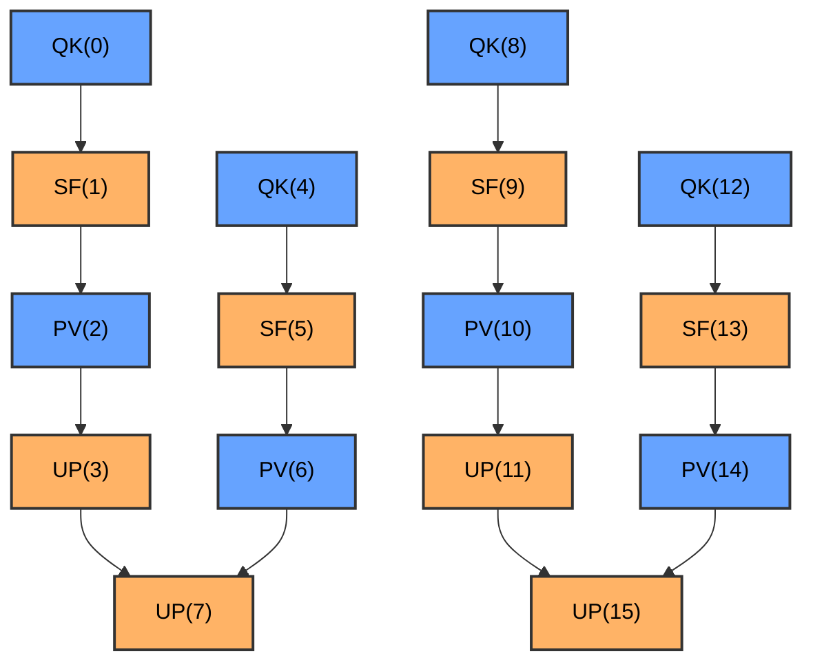

# Profiling & Debug Tools (shipped in the wheel)

End-user CLIs for analyzing PTO Runtime profiling data and tensor dumps.
All are invokable as Python modules once the `simpler` wheel is installed —
no repo checkout required.

> Dev-only scripts (`benchmark_rounds.sh`, `verify_packaging.sh`) live in the
> repo-level [`tools/`](../../tools/) directory and are **not** shipped.

## Tool list

- **[swimlane_converter](#swimlane_converter)** — perf JSON → Chrome Trace Event (Perfetto)
- **[sched_overhead_analysis](#sched_overhead_analysis)** — scheduler overhead / Tail OH breakdown
- **[perf_to_mermaid](#perf_to_mermaid)** — perf JSON → Mermaid dependency graph
- **[dump_viewer](#dump_viewer)** — inspect / export tensor dumps (see [docs/tensor-dump.md](../../docs/tensor-dump.md) for full workflow)
- **[device_log_resolver](#device_log_resolver)** — shared device-log path resolver library

Auto-detection paths (`outputs/*/l2_perf_records.json`, `outputs/*/tensor_dump/`)
are resolved relative to the **current working directory** — run these from the
directory that holds your `outputs/`. Each test case writes into its own
`outputs/<case>_<ts>/` directory; the tools auto-pick the latest by mtime.

---

## swimlane_converter

Convert performance profiling JSON files into Chrome Trace Event format for visualization in Perfetto.

### Overview

Converts PTO Runtime profiling data (`l2_perf_records_*.json`) into the format used by the Perfetto trace viewer (<https://ui.perfetto.dev/>). It also produces a task execution statistics summary grouped by function, and emits a scheduler overhead deep-dive report when a device log is resolved.

### Basic Usage

```bash
# Auto-detect the latest profiling file under ./outputs/
python -m simpler_setup.tools.swimlane_converter

# Specify an input file
python -m simpler_setup.tools.swimlane_converter outputs/<case>_<ts>/l2_perf_records.json

# Specify an output file
python -m simpler_setup.tools.swimlane_converter outputs/<case>_<ts>/l2_perf_records.json -o custom_output.json

# Load function name mapping from kernel_config.py
python -m simpler_setup.tools.swimlane_converter outputs/<case>_<ts>/l2_perf_records.json \
    -k examples/host_build_graph/paged_attention/kernels/kernel_config.py

# Select the device log automatically using a specific device id (device-<id>)
python -m simpler_setup.tools.swimlane_converter outputs/<case>_<ts>/l2_perf_records.json -d 0

# Verbose mode (for debugging)
python -m simpler_setup.tools.swimlane_converter outputs/<case>_<ts>/l2_perf_records.json -v
```

### Command-Line Options

| Option | Short | Description |
| ------ | ----- | ----------- |
| `input` | | Input JSON file (l2_perf_records_*.json). If omitted, the latest file in outputs/ is used |
| `--output` | `-o` | Output JSON file (default: outputs/merged_swimlane_`<timestamp>`.json) |
| `--kernel-config` | `-k` | Path to kernel_config.py, used for function name mapping |
| `--device-log` | | Device log file/directory/glob that overrides inputs (highest priority) |
| `--device-id` | `-d` | Device id used to auto-select the log from the `device-<id>` directory |
| `--verbose` | `-v` | Enable verbose output |

### Device Log Selection Priority

`swimlane_converter` and `sched_overhead_analysis` share the same resolution rules (from `device_log_resolver`):

1. `--device-log` (file/directory/glob) explicit override
2. `-d/--device-id` maps to the `device-<id>` directory
3. Auto-scan `device-*`, selecting the `.log` closest to the perf timestamp

Log root resolution order:

- `$ASCEND_WORK_PATH/log/debug/`
- `~/ascend/log/debug/` (fallback)

### Outputs

The tool produces three kinds of output:

#### 1. Perfetto JSON File

A Chrome Trace Event format JSON file that can be visualized in Perfetto:

- File location: `outputs/merged_swimlane_<timestamp>.json`
- Open <https://ui.perfetto.dev/> and drag-and-drop the file to visualize

#### 2. Task Statistics

A statistics summary grouped by function (printed to the console), including Exec/Latency comparison and scheduling overhead analysis:

- **Exec**: kernel execution time on AICore (end_time - start_time)
- **Latency**: end-to-end latency from the AICPU perspective (finish_time - dispatch_time, including head OH + Exec + tail OH)
- **Head/Tail OH**: scheduling head/tail overhead
- **Exec_%**: Exec / Latency percentage (kernel utilization)

When the device log is resolved, Sched CPU (actual CPU time of the AICPU scheduler thread per task) and the Exec/Sched_CPU ratio are also printed.

#### 3. Scheduler Overhead Deep-Dive (Automatic)

When the device log is successfully resolved, `swimlane_converter` invokes the `sched_overhead_analysis` logic directly and emits in the same run:

- Part 1: Per-task time breakdown
- Part 2: AICPU scheduler loop breakdown
- Part 3: Tail OH distribution & cause analysis

### Integration with run_example.py

When running a test with profiling enabled, the converter is invoked automatically:

```bash
# Run the test with profiling enabled - merged_swimlane.json is generated automatically after the test passes
python examples/scripts/run_example.py \
    -k examples/host_build_graph/vector_example/kernels \
    -g examples/host_build_graph/vector_example/golden.py \
    --enable-l2-swimlane
```

After the test passes, the tool will:

1. Auto-detect the latest `l2_perf_records_*.json` in outputs/
2. Load function names from the kernel_config.py specified via `-k`
3. Propagate the effective runtime device id (`-d`) to `swimlane_converter`
4. Resolve the device log automatically and print the selection strategy
5. Produce `merged_swimlane_*.json` for visualization
6. Print the task statistics and scheduler overhead deep-dive report to the console

---

## sched_overhead_analysis

Analyze AICPU scheduler overhead and quantitatively decompose the sources of Tail OH (the latency between task completion and scheduler acknowledgement).

### Overview

`sched_overhead_analysis` analyzes two data sources:

1. **Perf profiling data** (`l2_perf_records_*.json`): extracts per-task Exec / Head OH / Tail OH time breakdowns
2. **Device log**: parses the AICPU scheduler thread's loop breakdown (scan / complete / dispatch / idle), lock contention, and fanout statistics

Three device log formats are supported:

1. **New two-level tree** (`PTO2_SCHED_PROFILING=1`): `=== Scheduler Phase Breakdown: total=Xus, Y tasks ===` followed by per-phase lines
2. **Legacy detailed** (`PTO2_SCHED_PROFILING=1`): `completed=X tasks in Yus (Z loops, W tasks/loop)` followed by `--- Phase Breakdown ---` with phase lines carrying fanout/fanin/pop statistics
3. **Summary** (`PTO2_SCHED_PROFILING=0`): `Scheduler summary: total_time=Xus, loops=Y, tasks_scheduled=Z`

### Basic Usage

```bash
# Auto-pick the latest perf data and device log
python -m simpler_setup.tools.sched_overhead_analysis

# Use a specific device id to auto-pick the device-<id> log
python -m simpler_setup.tools.sched_overhead_analysis --l2-perf-records-json outputs/<case>_<ts>/l2_perf_records.json -d 0

# Specify files explicitly
python -m simpler_setup.tools.sched_overhead_analysis \
    --l2-perf-records-json outputs/<case>_<ts>/l2_perf_records.json \
    --device-log ~/ascend/log/debug/device-0/device-*.log
```

### Command-Line Options

| Option | Description |
| ------ | ----------- |
| `--l2-perf-records-json` | Path to the l2_perf_records_*.json file. If omitted, the latest file in outputs/ is auto-selected |
| `--device-log` | Device log file/directory/glob that overrides inputs (highest priority) |
| `-d, --device-id` | Device id used to auto-pick the log from `device-<id>` |

### Outputs

Output is emitted in three parts:

- **Part 1: Per-task time breakdown** - Exec / Head OH / Tail OH percentages of Latency
- **Part 2: AICPU scheduler loop breakdown** - per-scheduler-thread loop statistics, per-phase (scan / complete / dispatch / idle) time ratios, lock contention, and fanout/fanin/pop statistics
- **Part 3: Tail OH distribution & cause analysis** - Tail OH quantile distribution (P10-P99), correlation between scheduler loop iteration time and Tail OH, and data-driven insights into the dominant phase

---

## perf_to_mermaid

Convert profiling data into Mermaid flowchart format to visualize task dependencies.

### Overview

`perf_to_mermaid` converts PTO Runtime profiling data (`l2_perf_records_*.json`) into Mermaid flowchart format. The generated Markdown file can be:

- Rendered directly in GitHub/GitLab
- Viewed at <https://mermaid.live/>
- Viewed in Mermaid-capable editors (e.g., VS Code with the Mermaid plugin)

### Basic Usage

```bash
# Auto-detect the latest profiling file under ./outputs/
python -m simpler_setup.tools.perf_to_mermaid

# Specify an input file
python -m simpler_setup.tools.perf_to_mermaid outputs/<case>_<ts>/l2_perf_records.json

# Specify an output file
python -m simpler_setup.tools.perf_to_mermaid outputs/<case>_<ts>/l2_perf_records.json -o diagram.md

# Load function name mapping from kernel_config.py
python -m simpler_setup.tools.perf_to_mermaid outputs/<case>_<ts>/l2_perf_records.json \
    -k examples/host_build_graph/paged_attention/kernels/kernel_config.py

# Use compact style (only task id and function name)
python -m simpler_setup.tools.perf_to_mermaid outputs/<case>_<ts>/l2_perf_records.json --style compact

# Specify flowchart direction (left to right)
python -m simpler_setup.tools.perf_to_mermaid outputs/<case>_<ts>/l2_perf_records.json --direction LR

# Verbose mode
python -m simpler_setup.tools.perf_to_mermaid outputs/<case>_<ts>/l2_perf_records.json -v
```

### Command-Line Options

| Option | Short | Description |
| ------ | ----- | ----------- |
| `input` | | Input JSON file (l2_perf_records_*.json). If omitted, the latest file in outputs/ is used |
| `--output` | `-o` | Output Markdown file (default: outputs/mermaid_diagram_`<timestamp>`.md) |
| `--kernel-config` | `-k` | Path to kernel_config.py, used for function name mapping |
| `--style` | | Node style: `detailed` (default, includes function name and task id) or `compact` (task id only) |
| `--direction` | | Flowchart direction: `TD` (top-down, default) or `LR` (left-to-right) |
| `--verbose` | `-v` | Enable verbose output |

### Outputs

Generates a Markdown file containing a Mermaid flowchart:

#### Detailed Style (Default)



---

## dump_viewer

Inspect and export tensors captured by the runtime tensor-dump feature.
See [docs/tensor-dump.md](../../docs/tensor-dump.md) for the full capture workflow;
this section only documents CLI invocation.

### Basic Usage

```bash
# List all tensors (auto-picks latest outputs/tensor_dump_* dir)
python -m simpler_setup.tools.dump_viewer

# Filter by stage/role/func_id
python -m simpler_setup.tools.dump_viewer --func 3 --stage before --role input

# Export the current selection to txt
python -m simpler_setup.tools.dump_viewer --func 3 --stage before --role input --export

# Export a specific tensor by index (always exports)
python -m simpler_setup.tools.dump_viewer outputs/<case>_<ts>/tensor_dump/ --index 42
```

---

## device_log_resolver

Device log path resolution library, shared by `swimlane_converter` and `sched_overhead_analysis`. Not a standalone CLI — imported as a module.

### Main Functions

| Function | Description |
| -------- | ----------- |
| `get_log_root()` | Returns the log root path (`$ASCEND_WORK_PATH/log/debug/` or `~/ascend/log/debug/`) |
| `infer_device_id_from_log_path(log_path)` | Infers the device id from a path (e.g., `device-0`) |
| `resolve_device_log_path(device_id, device_log, l2_perf_records_path)` | Resolves the device log path by priority, returning `(Path, strategy_string)` |

### Resolution priority

1. **Explicit path** (`--device-log`): supports file, directory, and glob patterns
2. **Device ID** (`--device-id`): selects the latest `.log` from `<log_root>/device-<id>/`
3. **Auto-scan**: iterates all `device-*` directories and selects the `.log` closest to the perf timestamp

### Usage

```python
from simpler_setup.tools.device_log_resolver import resolve_device_log_path

log_path, strategy = resolve_device_log_path(
    device_id="0",
    device_log=None,
    l2_perf_records_path=Path("outputs/<case>_<ts>/l2_perf_records.json"),
)
```

---

## Shared Configuration

### Input File Format

The analysis tools share the same input format - the `l2_perf_records_*.json` files generated by the PTO Runtime:

```json
{
  "version": 1,
  "tasks": [
    {
      "task_id": 0,
      "func_id": 0,
      "core_id": 0,
      "core_type": "aic",
      "start_time_us": 100.0,
      "end_time_us": 250.5,
      "duration_us": 150.5,
      "fanout": [1, 2],
      "fanout_count": 2
    }
  ]
}
```

### Kernel Config Format

To display meaningful function names in the output, provide a `kernel_config.py` file:

```python
KERNELS = [
    {
        "func_id": 0,
        "name": "QK",
        # ... other fields
    },
    {
        "func_id": 1,
        "name": "SF",
        # ... other fields
    },
]
```

The tools extract the `func_id` to `name` mapping from the `KERNELS` list.

---

## Tool Selection Guide

### Use swimlane_converter when you need

- A detailed timeline execution view
- To analyze task scheduling across different cores
- To see precise execution times and intervals
- Task execution statistics
- Professional performance analysis and optimization

### Use perf_to_mermaid when you need

- A quick look at task dependencies
- To embed a dependency graph in documentation
- To share dependency structure in a code review
- Only topological structure, without timeline detail
- Direct viewing in GitHub/GitLab

### Recommended Workflow

```bash
# 1. Run the test to produce profiling data
python examples/scripts/run_example.py -k ./kernels -g ./golden.py --enable-l2-swimlane

# 2. Generate Perfetto visualization (automatic)
# -> outputs/merged_swimlane_*.json

# 3. Generate Mermaid dependency graph
python -m simpler_setup.tools.perf_to_mermaid -k ./kernels/kernel_config.py

# 4. Analyze results
# - Detailed performance analysis: Perfetto (https://ui.perfetto.dev/)
# - Dependency overview: Mermaid diagram (GitHub/editor)
# - Statistics summary: console output
```

For batch-run hardware regression, see the dev-only script
[`tools/benchmark_rounds.sh`](../../tools/benchmark_rounds.sh).

---

## Troubleshooting

### Error: cannot find l2_perf_records_*.json file

- Make sure the test was run with the `--enable-l2-swimlane` flag
- Check that the outputs/ directory exists and contains profiling data

### Warning: Kernel entry missing 'func_id' or 'name'

- Check the kernel_config.py file format
- Make sure every KERNELS entry has a 'func_id' and 'name' field

### Error: Unsupported version

- The tools only support version 1 of the profiling data format
- Regenerate the profiling data with the latest runtime

### Error: Perf JSON missing required fields for scheduler overhead analysis

- This error means the input `l2_perf_records_*.json` lacks fields required by the deep-dive analysis (typically `dispatch_time_us` / `finish_time_us`)
- The basic conversion in `swimlane_converter` can still succeed, but the deep-dive will be skipped or fail
- Remediation:
  1. Re-run with `--enable-l2-swimlane` to produce a new `outputs/*/l2_perf_records.json`
  2. Re-run `swimlane_converter` or `sched_overhead_analysis`
  3. Verify that each task in the JSON contains `dispatch_time_us` and `finish_time_us`

### Mermaid diagram does not render on GitHub

- Make sure the file has the `.md` extension
- Check that the Mermaid syntax is correct
- GitHub sometimes needs a refresh before rendering Mermaid diagrams

---

## Output File Reference

| File | Tool | Purpose | Format |
| ---- | ---- | ------- | ------ |
| `l2_perf_records_*.json` | Runtime | Raw profiling data | JSON |
| `merged_swimlane_*.json` | swimlane_converter | Perfetto visualization | Chrome Trace Event JSON |
| `mermaid_diagram_*.md` | perf_to_mermaid | Dependency graph | Markdown + Mermaid |

---

## Related Resources

- [Perfetto Trace Viewer](https://ui.perfetto.dev/)
- [Mermaid Live Editor](https://mermaid.live/)
- [Mermaid documentation](https://mermaid.js.org/)
